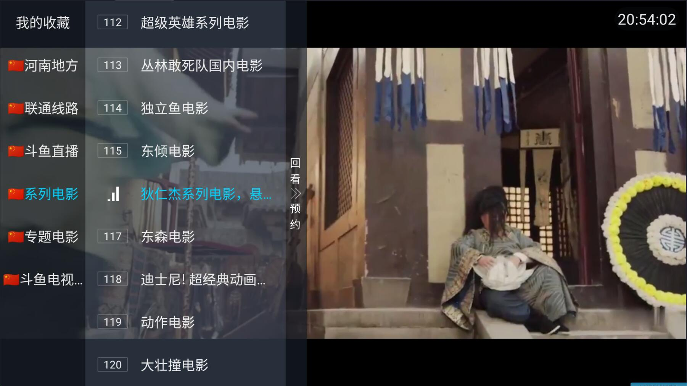
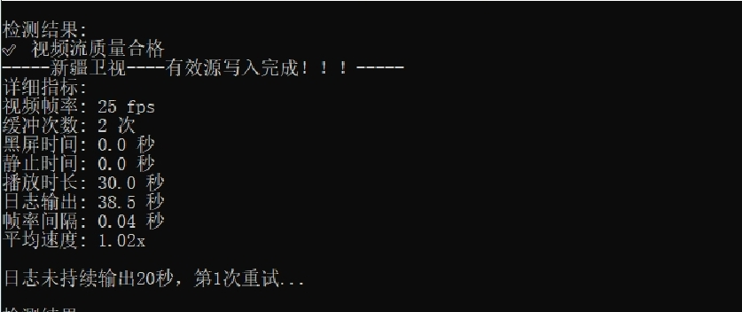

### 电视直播源

# 主在验证直播源的播放速度，选择最优直播源，提高观看体验

一切源于网络，检索，分类验证提取高效直播源：

精选直播源订阅地址： [live](https://ghfast.top/raw.githubusercontent.com/Supprise0901/TVBox_live/main/live.txt)

* 地址说明，一台多源，资源的快慢与宽带运营线路有关，建议将线路选择调整为10/15秒，等待适配网络源，日常卡顿会及时切换到高速源，进行直播观看
* **高清源首次加载比较缓慢，加载完成后，播放速度会有明显提升**
* **基于联通线路搜索提取的高速源**

### 安卓直播软件壳下载
*  ### 直播源链接无法打开，请自行配置更换加速
*  注意，直播源更新频率较快；使用其他直播软件必须设置直播源不缓存(设置-直播源-直播源缓存时间-不缓存)，打开即重新加载直播源； 
*  以下直播软件已内置精选直播源，修改为不缓存，安装打开直接看直播
*  天光云影推荐设置  1.设置-应用-打开直接进入直播 2.设置-界面-经典选台界面 3.设置-播放器-全局显示模式-16:9  
*  [天光云影 下载](https://supprise.lanzouw.com/iBulb2ne9yle) （推荐 秒换台，速度快； BUG：部分直播源无法播放，切换内核解决，设置-播放器-内核 ）
*  [直播 下载](https://supprise.lanzouw.com/i2RXP2ne94cf)    （推荐 播放器稳定）

### 本地版直播源分类合并、检索、验证高效源，提取工具

* 适配本地网络运营的高效直播源检索提取工具（具体说明详见压缩包内说明文档）
* 2023/12/18 直播源去重，增加直播流播放速度测试 
* 2023/12/21 新增速度测试阈值
* 2023/12/24 origin直播源txt文件转化为统一编码（txt编码UTF-8会转换乱码，手动另存为编码UTF-8）
* 2023/12/28 新增网络直播源下载本地；
* 2024/12/16 新增url直播源下载转换，新增ffmpeg速度检测，新增本地web发布直播源；
* 2025/01/16 新增直播源关键词筛除；main新增是否清空历史直播源
* 2025/01/19 修改ffmpeg检测逻辑，模拟直播源播放速度测试，超线程+多并发测试，回收内存修复溢出错误；
* 2025/01/25 修复origin去重逻辑；重构ffmpeg测试逻辑，增加画面，缓存，码率，丢帧，卡顿，延迟异常测试；
* 2025/02/03 增加视频流测试时间、重试机制、帧率稳定性测试、多线程与资源管理
* 2025/02/10 修改各项参数，提高筛选精度； 必须使用FFmpeg4.0或更高版本，显卡驱动到最新版本
- [x] 修改 视频流播放时间大于20
- [x] 增加 调用显卡进行硬件加速
- [x] 增加 帧率间隔(1/FPS)判断视频卡顿
- [x] 修改 画面敏感度阈值（-60db）静止时间3s 判断静止画面
- [x] 修改 黑屏参数4s
- [x] 修复 FFmpeg日志收集重试机制 log必须大于20s输出 获取足够视频流
* 2025/02/14 run_speed_ffmpeg 手动创建线程池改为自动线程管理,多源测试防止硬件资源拉满
* [下载地址](https://supprise.lanzouw.com/iLYuY2nrnveb)

#

